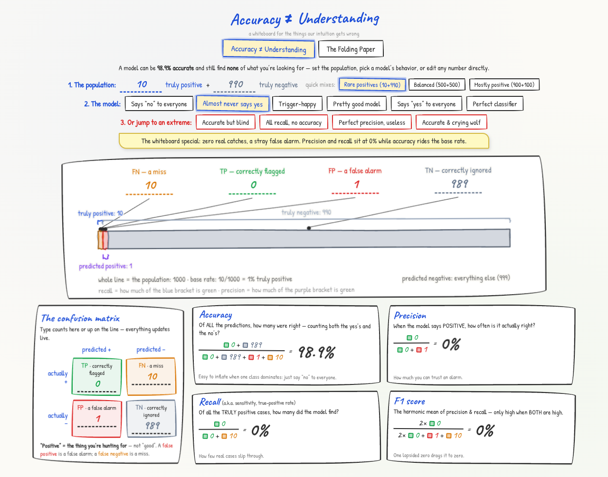
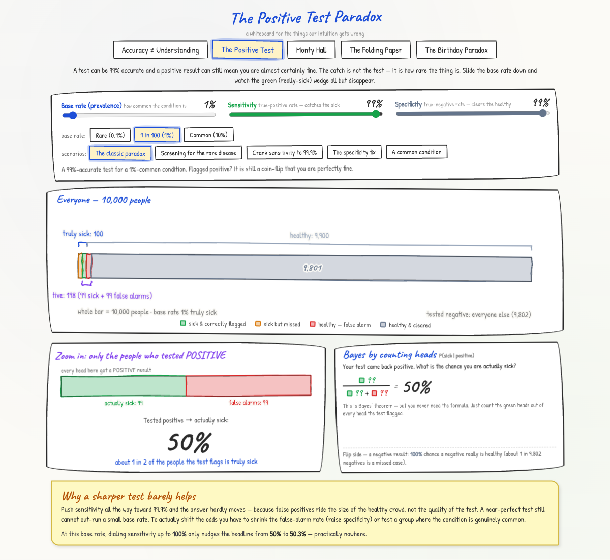
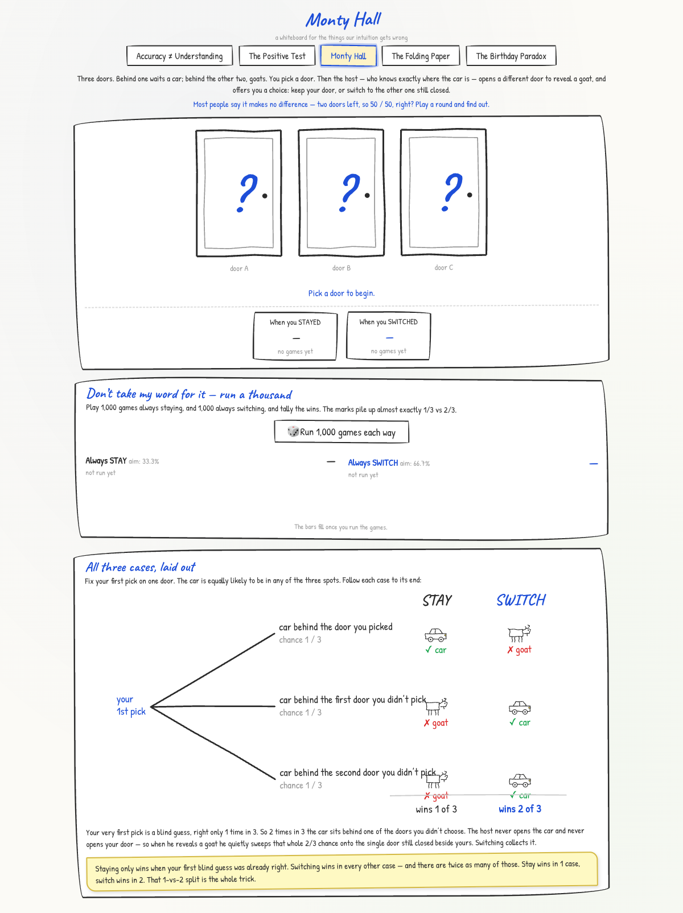
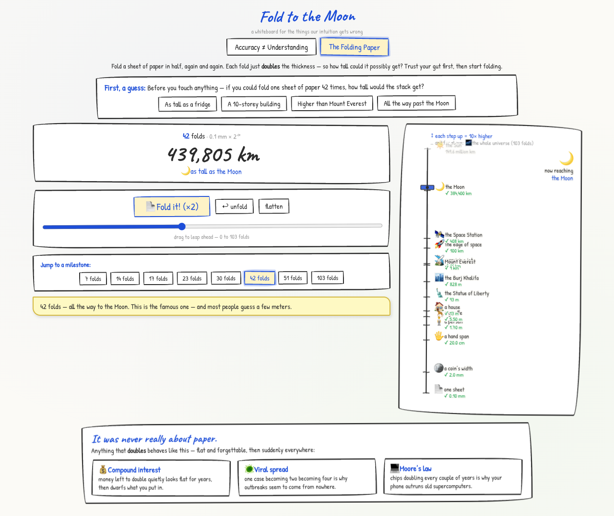
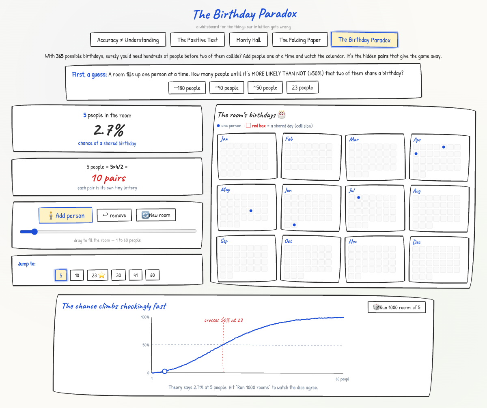

# Understand Accuracy

An interactive, hand-drawn "whiteboard" for the things our intuition gets wrong about
numbers — built with React 19 and Vite.

🔗 **Repository:** https://github.com/geseib/understandaccuracy

It has five self-contained explainers, split across two threads — *statistics that
mislead* and *growth that explodes*:

## Accuracy ≠ Understanding

A live confusion-matrix playground for **accuracy, precision, recall, and F1**.
Set the population, pick a model's behavior, or edit any count directly — every
number, formula, and the population line update instantly. Jump to one-click
"extremes" to see how a model can be 98.9% accurate while finding *none* of what
you're looking for.



## The Positive Test Paradox

The flip side of the accuracy page. A test is 99% accurate and you just tested
positive — so what are the odds you're *actually* sick? For a rare condition, often
shockingly low. Drag prevalence, sensitivity, and specificity and watch the "keep
only the positives" bar collapse until the truly-sick wedge is a sliver — then see
that cranking sensitivity to 99.9% barely moves the number, because false positives
ride the size of the healthy crowd, not the quality of the test.



## Monty Hall

Three doors, one car, two goats. You pick; the host opens a goat; do you switch?
Play a round, then run 1,000 games each way and watch the tally marks settle near
**33% for staying vs 67% for switching**. A three-branch tree (with a hand-drawn car
and goat) shows why: your first pick is right only 1 in 3 times, and the host's
knowledge pours the other two-thirds onto the door you didn't choose.



## Fold to the Moon

An exponential-growth demo: a single sheet of paper, 0.1 mm thick, doubling with
every fold. Guess first, then fold — and watch the stack stay flat for ten folds,
then blow past Everest, the edge of space, and reach the Moon at 42 folds.



## The Birthday Paradox

It takes just **23 people** for a shared birthday to be more likely than not. Guess
first, then add people one at a time and watch dots land on twelve whiteboard
calendars — the moment two collide, the day lights up. A live pairs counter
(`n·(n−1)/2`) exposes the real engine, the probability curve rockets past 50% right
at 23, and "run 1,000 rooms" checks the formula against actual dice.



## Running locally

```bash
npm install
npm run dev      # start the dev server
npm run build    # production build to dist/
npm run preview  # preview the built site
```

Requires Node.js 20.19+ or 22.12+ (Vite 7).

## Deployment

The app builds for two targets, switched automatically in `vite.config.js`:

- **Vercel** — served at the root (`/`).
- **GitHub Pages** — served under `/understandaccuracy/`.

## Tech

React 19 · Vite 7 · inline styles and seeded SVG "marker" strokes — no UI
framework, no router, no test suite.
